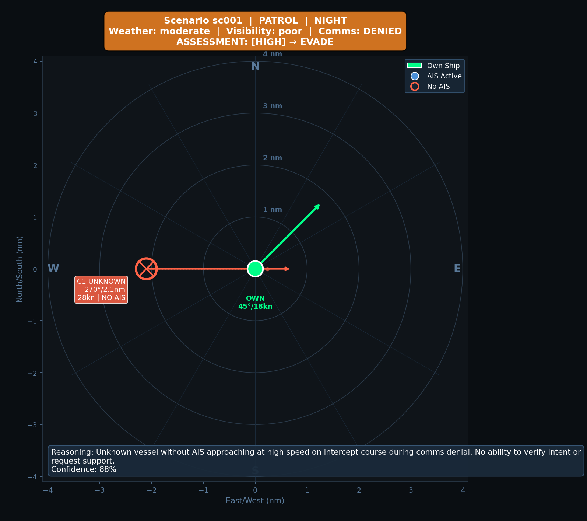

# Edge LLM for Maritime Situational Awareness

> Can a small LLM make tactical decisions on 7 watts?

**4-hour hackathon POC** exploring whether fine-tuned small LLMs can outperform rule-based systems for autonomous maritime decision-making on edge hardware.

## Table of Contents

- [The Problem](#the-problem)
- [Approach](#approach)
- [Results](#results)
- [Key Findings](#key-findings)
- [Research Foundations](#research-foundations)
- [Notebooks](#notebooks)
- [Project Structure](#project-structure)

---

## The Problem

### Background

Autonomous maritime drones operate in contested waters where communication is denied or degraded. When a drone detects an unknown vessel approaching at high speed with no AIS transponder, it must decide: continue mission, monitor, evade, alert command, or abort?

This decision requires interpreting ambiguous sensor data. The drone can't call home. It must decide now.

```
22:47 UTC | Baltic Sea | Comms: DENIED

RADAR CONTACT:
  Bearing: 270°, Distance: 2.1 nm
  Speed: 28 kn, Heading: 090° → INTERCEPT COURSE
  AIS: None
  Visual: Low profile, no navigation lights

What do you do?
```



*Example scenario: Unknown vessel (red) approaching on intercept course. No AIS, no lights. Own ship (green) must decide: continue, monitor, evade, alert, or abort.*

### The Limits of Rules

A rule-based system handles clear cases: "if distance < 1nm and no AIS, evade." But rules fail on nuance:

- Is 28 knots fast? For a cargo ship, yes. For a military patrol boat, normal.
- "Low profile, no lights" - suspicious, or just a small fishing vessel?
- Two contacts converging from opposite sides - coincidence or coordinated?

Rules encode thresholds. They don't reason about intent, context, or combinations of weak signals.

### The Limits of Edge Devices

Large language models can reason about ambiguity. But GPT-4 runs on datacenter hardware drawing 300+ watts. A maritime drone has 7-15W for all compute. The model must:

- Fit in ~4GB RAM (quantized)
- Run inference in <2 seconds
- Produce valid, parseable output every time

### Hypothesis

A small LLM, fine-tuned on expert reasoning traces, can outperform rule-based systems on ambiguous maritime scenarios - while running on edge hardware.

---

## Approach

### Models Evaluated


| Model       | Parameters | Platform | Notes                           |
| ----------- | ---------- | -------- | ------------------------------- |
| Gemma 4 E2B | 2.1B       | Colab T4 | Google's edge-optimized model   |
| Gemma 2B    | 2B         | Colab T4 | Stable, well-supported baseline |


### Pipeline

1. **Data**: 300 synthetic scenarios labeled by Claude (teacher model)
2. **Eval**: Rule-based baseline
3. **Eval**: Raw LLM (no fine-tuning)
4. **Train**: LoRA fine-tuning on 240 examples
5. **Eval**: Fine-tuned model on 60 held-out examples

---

## Results

### Dataset

**300 scenarios** labeled by `claude-opus-4-5-20251101` as teacher model.


| Attribute     | Distribution                                             |
| ------------- | -------------------------------------------------------- |
| Threat levels | none 28%, low 20%, medium 17%, high 21%, critical 14%    |
| Actions       | continue 29%, monitor 33%, evade 24%, alert 9%, abort 5% |


### Model Comparison


| Model                    | Threat | Action | Full      | Parse Errors |
| ------------------------ | ------ | ------ | --------- | ------------ |
| **Rule-based**           | 44.3%  | 57.7%  | **36.0%** | N/A          |
| Gemma 4 E2B (raw)        | 25.7%  | 37.0%  | 22.7%     | 0%           |
| Gemma 2B (raw)           | 28.3%  | 30.0%  | 18.3%     | 0%           |
| Gemma 2B (LoRA, 1 epoch) | 23.3%  | 33.3%  | 20.0%     | 0%           |


### Rule-Based Baseline Details

Rules achieve 36% full accuracy but fail on nuanced cases:


| Threat Level | Accuracy    |     | Action   | Accuracy    |
| ------------ | ----------- | --- | -------- | ----------- |
| critical     | 100% ✓      |     | abort    | 87.5%       |
| none         | 56.0%       |     | evade    | 69.0%       |
| medium       | 32.0%       |     | continue | 60.5%       |
| low          | 29.5%       |     | monitor  | 52.0%       |
| high         | **14.5%** ✗ |     | alert    | **22.2%** ✗ |


**Calibration Error: 0.49** - High confidence outputs are wrong 64% of the time.

Rules can't decide when to escalate (ALERT: 22%) or recognize subtle high-threat situations (HIGH: 14.5%).

---

## Key Findings

### 1. Raw LLMs Have Mode Collapse

Both Gemma models default to "safe" predictions regardless of input:

```
Ground Truth Distribution          Gemma 4 E2B Predictions
─────────────────────────          ───────────────────────
critical  14% ████                 low/monitor   70% ████████████████████
high      21% ██████               medium/monitor 17% █████
medium    17% █████                none/continue   8% ██
low       20% ██████               low/continue    5% █
none      28% ████████
```

Rules respond to signals (100% on `critical`). LLMs ignore input and output the same thing.

### 2. Minimal Fine-Tuning Shows Minimal Improvement

One epoch of LoRA fine-tuning (rank 4, 240 examples) improved accuracy by only +1.7%. Needs:

- **More epochs** - 3-5 typical for meaningful learning
- **Higher LoRA rank** - rank 4 may be too constrained
- **More data** - 240 examples insufficient to break mode collapse

### 3. Hardware Constraints Are Real


| Model              | VRAM Required | Colab T4 (15GB)    |
| ------------------ | ------------- | ------------------ |
| Gemma 4 E4B (bf16) | ~16GB         | ❌ OOM              |
| Gemma 4 E2B (bf16) | ~5GB          | ✅ Inference only   |
| Gemma 2B (bf16)    | ~5GB          | ✅ Inference + LoRA |


Fine-tuning larger models requires:

- Colab Pro (A100) or
- 4-bit quantization (bitsandbytes issues on Colab) or
- Unsloth optimizations

### 4. The Path Forward

To beat the 36% rule baseline, production deployment would need:

1. **Larger model** - Gemma 4 E4B or 7B class
2. **More training** - 3+ epochs, higher LoRA rank (8-16)
3. **More data** - 1000+ labeled scenarios
4. **Quantization** - GGUF Q4 for edge deployment (~2GB)

### 5. Why We Stopped Here

**Time constraint**: 4-hour hackathon.

This POC focused on the **hardest question first**: can a small LLM outperform rules on ambiguous scenarios?

Answer: **not yet**. Raw models show mode collapse, minimal fine-tuning doesn't fix it. Quantizing and deploying a model that performs worse than rules proves nothing.

**Ready but not executed:**

- `edge/deploy.py` - GGUF quantization + llama.cpp benchmarking
- Raspberry Pi 5 deployment scripts

**When to proceed:**

- Fine-tuned model beats 36% rule baseline
- Then quantize → measure accuracy drop → deploy if acceptable

---

## Research Foundations

### LoRA: Low-Rank Adaptation

Hu et al. (2021) - Train ~0.1% of parameters by learning low-rank weight updates.

### Outlines: Constrained Decoding

Willard & Louf (2023) - Guarantee valid JSON output via grammar-constrained generation.

### HELM: Holistic Evaluation

Liang et al. (2022) - Evaluate beyond accuracy: calibration, consistency, robustness.

### QLoRA: Quantized Fine-Tuning

Dettmers et al. (2023) - Fine-tune 4-bit models on consumer GPUs.

### Orca 2: Reasoning Distillation

Mitra et al. (2023) - Train small models on reasoning traces from larger models.

---

## Notebooks

### `notebooks/COLAB_EVAL.md`

Raw model evaluation on Colab T4. Tests Gemma 4 E2B inference.

### `notebooks/COLAB_FINETUNE.md`

LoRA fine-tuning with Keras + JAX. Includes:

- Train/eval split (240/60)
- LoRA configuration (rank 4)
- Training loop
- Before/after comparison

---

## Project Structure

```
data/
  schema.py           # Pydantic models (Scenario, Decision)
  generate.py         # Synthetic data generation
  rule_label.py       # Rule-based labeling
  train_data.jsonl    # 300 Claude-labeled scenarios

notebooks/
  COLAB_EVAL.md       # Raw model evaluation
  COLAB_FINETUNE.md   # LoRA fine-tuning

eval/
  helm.py             # HELM-inspired evaluation

train/
  lora.py             # QLoRA fine-tuning (HuggingFace)

viz/
  visualize.py        # Tactical scenario plots

output/
  results_raw_e2b.json         # Gemma 4 E2B evaluation (300 scenarios)
  results_gemma2b_raw.json     # Gemma 2B raw evaluation (60 scenarios)
  results_gemma2b_finetuned.json  # Gemma 2B LoRA evaluation (60 scenarios)
  training_history.json        # LoRA training loss
```

---

## Quick Start

```bash
git clone https://github.com/hanng00/llm-edge-maritime.git
cd llm-edge-maritime

# Install dependencies
uv sync

# Preview scenarios
uv run python -m data.generate preview -n 5

# Visualize tactical plots
uv run python -m viz.visualize data/train_data.jsonl -n 6 --single

# Run rule-based evaluation
uv run python -m eval.helm run data/train_data.jsonl --model baseline
```

For Colab notebooks, see `notebooks/` directory.